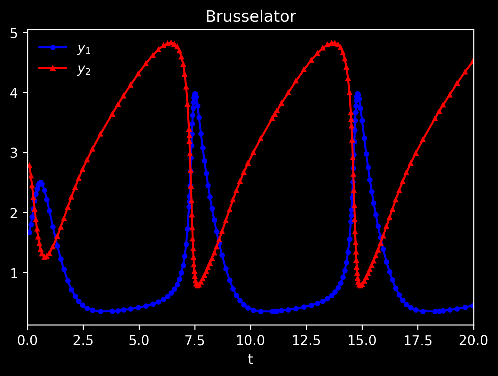

# lazyivy

lazyivy is a Rust library for solving initial value problems (IVPs) 
by using Runge-Kutta integration implemented using iterators. It provides a 
struct called `RungeKuttaIntegrator` that implements the `Iterator` trait. 

## Usage: 

After adding lazyivy to `Cargo.toml`, create an initial value problem using 
the various `new_*` methods for `RungeKuttaIntegrator`. Here is an example 
showing how to solve the [Brusselator](https://en.wikipedia.org/wiki/Brusselator). 

```rust
use lazyivy::{RungeKutta};
use ndarray::{s, Array, Array1};
 
 
fn brusselator(t: &f64, y: &Array1<f64>) -> Array1<f64> {
    Array::from_vec(vec![
        1. + y[0].powi(2) * y[1] - 4. * y[0],
        3. * y[0] - y[0].powi(2) * y[1],
    ])
}
 
fn main() {
    let t0: f64 = 0.;
    let y0 = Array::from_vec(vec![1.5, 3.]);
    let absolute_tol = Array::from_vec(vec![1.0e-4, 1.0e-4]);
    let relative_tol = Array::from_vec(vec![1.0e-4, 1.0e-4]);
 
    // Instantiate a integrator for an ODE system with adaptive step-size Runge-Kutta.
 
    let mut integrator = RungeKuttaSystemAdaptive::new_fehlberg(
        t0,                   // Initial condition - time
        y0,                   // Initial condition - Brusselator variables in Array[y1, y2]
        brusselator,          // Evaluation function
        |t, _| t > &20.,      // Predicate that determines stop condition
        0.025,                // Initial step size
        relative_tol,         // Relative tolerance for error estimation
        absolute_tol,         // Absolute tolerance for error estimation
    );
 
    // For adaptive algorithms, you can use this to improve the initial guess for the step size.
    integrator.h = integrator.guess_initial_step();
 
    // Perform the iterations and print each state.
    for item in integrator {
        println!("{:?}", item)   // Prints the tuple (t, array[y1, y2]) at each iteration 
    }
}
```
The result when plotted looks like this - 
